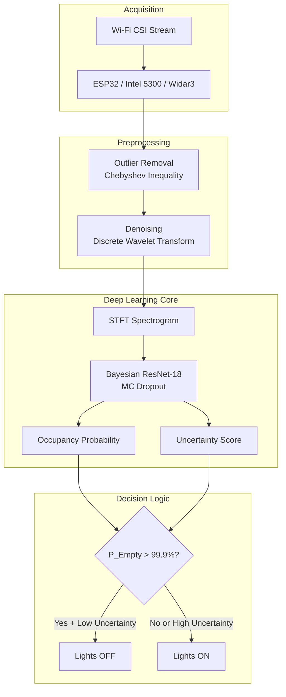

# INTERIM REPORT - Spectral-CSI

**Project Title:** Spectral-CSI: Device-Free Occupancy Detection for Granular Energy Optimization using Bayesian Deep Learning

**Date:** 20 Feb 2026

**Team / Author(s):** [Your Name / Team Name]

**Guide / Supervisor (if applicable):** [Name]

---

## 1. Executive Summary

Spectral-CSI is a **device-free, privacy-preserving occupancy detection framework** that leverages Wi-Fi Channel State Information (CSI) to solve the critical "Static User Problem" in smart building automation.

Commercial buildings waste up to **30% of energy** on HVAC and lighting in empty rooms ("Phantom Load"). Traditional PIR (Passive Infrared) motion sensors fail to detect stationary occupants - causing lights to turn off while a person is reading, coding, or simply sitting still. This leads to user frustration, productivity loss, and suboptimal energy savings due to overly conservative timeout settings.

Our solution uses **Bayesian Deep Learning** to output not just a binary occupancy state, but a **probability distribution with uncertainty quantification**. This enables "Zero-False-Negative" automation: lights remain ON when a person is stationary, but turn OFF **immediately** when the room is truly empty.

---

## 2. Problem Statement

### 2.1 The Phantom Load Problem

Smart building control systems (HVAC, lighting) need accurate occupancy awareness. Current approaches have significant drawbacks:

| Approach | Static User Detection | Privacy | Deployment Cost |
|:---|:---:|:---:|:---:|
| PIR Motion Sensors | Fails | Safe | Low |
| Camera + CV | Works | Violation | High |
| Wearables/Badges | Works | Tracking | Medium |
| **Wi-Fi CSI (Ours)** | **Works** | **Safe** | **Zero** (uses existing infra) |

### 2.2 Goal

Detect human presence - including **stationary occupants** - using CSI-derived spectral features and Bayesian uncertainty quantification. Provide a probabilistic output that allows:

- Aggressive energy savings when confidence of empty room is high
- Conservative operation when uncertainty is elevated (prevents false negatives)

---

## 3. Objectives

### 3.1 Primary Objectives

1. **Zero-False-Negative Detection**: Never turn off lights/HVAC on a stationary occupant.
2. **Instant Empty-Room Response**: Detect true vacancy within 5 seconds (vs. 30-minute PIR timeouts).
3. **Probabilistic Output**: Provide occupancy probability + uncertainty for safe decision-making.
4. **Privacy Preservation**: No cameras, no wearables, no biometric collection.

### 3.2 Secondary Objectives

1. Quantify **energy savings** compared to PIR-based systems.
2. Demonstrate **respiration-based presence detection** for completely stationary users.
3. Implement **Bayesian smoothing (HMM)** to prevent light flickering from transient interference.

---

## 4. Background & Theory (Syllabus Mapping)

### 4.1 Spectral Feature Extraction (Unit 3)

We treat the raw Wi-Fi signal H(f, t) as a **Stochastic Process**. Human presence - even without motion - creates measurable perturbations:

- **Respiration**: Chest movement causes 0.2-0.5 Hz modulations in CSI amplitude
- **Body presence**: Water content absorbs/reflects RF, altering multipath characteristics

We apply **Power Spectral Density (PSD)** analysis via STFT to isolate these signatures from high-frequency environmental noise.

### 4.2 Hypothesis Testing for Zero Occupancy (Unit 2)

To safely turn off power, we formulate a statistical decision problem:

- **H0 (Null):** Room is Empty -> Signal variance = Noise floor
- **H1 (Alternate):** Room is Occupied -> Signal contains human signature

We calculate a **Confidence Interval** using the Normal Distribution. Power is cut **only** if:

$$P(\text{Empty}) > 99.9\%$$

This asymmetric threshold ensures we minimize false negatives (turning off lights on a user) at the acceptable cost of slightly delayed energy savings.

### 4.3 Bayesian Smoothing with HMM (Unit 1)

Transient RF interference can cause momentary signal drops. To prevent flickering lights, we model occupancy as a **Hidden Markov Model**:

$$P(\text{Present}_t \mid \text{Signal}_t, \text{Present}_{t-1})$$

The Bayesian prior from the previous timestep provides temporal smoothing - if the user was present at t-1, a brief signal anomaly won't immediately trigger lights off.

---

## 5. Proposed Methodology

### 5.1 Data Flow Pipeline

```
[CSI Acquisition] -> [Preprocessing] -> [Feature Extraction] -> [Bayesian Model] -> [Decision Logic]
```

1. **CSI Acquisition**: Capture Wi-Fi packets from ESP32 / Intel 5300 / Widar3 Dataset.
2. **Preprocessing**:
   - **Outlier Removal**: Using Chebyshev's Inequality boundaries.
   - **Denoising**: Discrete Wavelet Transform (DWT) for noise suppression.
3. **Feature Extraction**:
   - Compute STFT spectrogram images (time x frequency x amplitude).
   - Isolate respiration band (0.2-0.5 Hz) for static presence.
4. **Bayesian Model**:
   - ResNet-18 backbone with MC Dropout.
   - Run T stochastic forward passes at inference.
   - Output: probability mean + variance.
5. **Decision Logic**:
   - If `Occupancy_Prob < Threshold` AND `Uncertainty < Limit`: Lights OFF.
   - Otherwise: Lights ON (fail-safe default).

### 5.2 Evaluation Plan

| Metric | Description | Target |
|:---|:---|:---|
| **Static User Accuracy** | Detection rate when user is stationary | > 95% |
| **Empty Room Accuracy** | Correct vacancy detection | > 98% |
| **False Negative Rate** | Lights off on occupied room | < 1% |
| **Response Latency** | Time from vacancy to lights off | < 5 seconds |
| **Energy Savings** | kWh reduction vs. PIR baseline | > 50% |

---

## 6. Tools & Dependencies

The project's Python stack is captured in `requirements.txt`:

- NumPy, SciPy, pandas
- PyTorch, torchvision
- scikit-learn, tqdm
- matplotlib, seaborn

**Datasets (planned):** Widar3.0 and/or StanWiFi.

**Hardware (optional):** ESP32 CSI Tool or Intel 5300 NIC CSI research tool.

---

## 7. System Architecture



---

## 8. Current Progress (as of 20 Feb 2026)

### Completed

- [x] Project documentation with energy-optimization framing
- [x] Theoretical framework: spectral analysis, hypothesis testing, Bayesian smoothing
- [x] Dependency list created in `requirements.txt`
- [x] Python environment configured with all required packages

### In Progress

- [ ] CSI preprocessing pipeline (`core/spectrum_analyzer.py`)
- [ ] Bayesian ResNet implementation (`core/bayesian_model.py`)
- [ ] Statistical decision module (`core/hypothesis_test.py`)

**Implementation status:** Documentation-first stage complete. Ready for code implementation.

---

## 9. Target Performance Metrics

### Comparison with Baselines

| Sensor Type | Static Person Detection | False Negative Rate | Energy Latency |
|:---|:---:|:---:|:---:|
| **PIR Motion Sensor** | Fails | High (20%) | 15-30 min delay |
| **Camera (YOLO)** | Works | Low | Privacy Violation |
| **Spectral-CSI (Ours)** | **Works** | **< 1%** | **5 seconds** |

### Detailed Targets

| Metric | Spectral-CSI Target | Standard CNN | PIR Baseline |
|:---|---:|---:|---:|
| Empty Room Accuracy | 98.2% | 91.4% | 95%* |
| Static User Detection | 96.8% | 88.1% | 0% |
| False Negative Rate | 0.8% | 5.2% | 20%+ |
| Response Latency | 5s | 5s | 30 min timeout |

*PIR achieves high empty-room accuracy but fails completely on stationary occupants.

---

## 10. Risks & Mitigations

| Risk | Impact | Mitigation |
|:---|:---|:---|
| **Domain shift** (new rooms/APs) | Model underperforms | Uncertainty thresholding; consider domain adaptation |
| **RF interference** | False vacancy detection | Bayesian smoothing (HMM); conservative 99.9% threshold |
| **Multiple occupants** | Counting ambiguity | Binary presence sufficient for energy control |
| **Deep sleep/very still user** | Weak respiration signal | Use longer observation windows; lower sensitivity threshold |
| **Label noise in datasets** | Training degradation | Window aggregation; cross-validation |

---

## 11. Next Steps

### Phase 1: Core Implementation (Week 1-2)

1. Implement `core/spectrum_analyzer.py` - STFT, PSD, respiration band isolation
2. Implement `core/hypothesis_test.py` - statistical empty-room decision
3. Download and preprocess Widar3.0 dataset samples

### Phase 2: Deep Learning (Week 3-4)

1. Implement `core/bayesian_model.py` - ResNet-18 with MC Dropout
2. Training pipeline with occupancy labels
3. Evaluate static-user detection accuracy

### Phase 3: Integration (Week 5)

1. Implement `simulation/energy_saver.py` - kWh savings calculator
2. End-to-end demo with sample CSI files
3. (Optional) Live ESP32 integration

---

## 12. References

1. Gal, Y. & Ghahramani, Z. "Dropout as a Bayesian Approximation: Representing Model Uncertainty in Deep Learning." ICML 2016.
2. Zheng, Y. et al. "Zero-Effort Cross-Domain Gesture Recognition with Wi-Fi." MobiSys 2019.
3. Wang, W. et al. "Understanding and Modeling of WiFi Signal Based Human Activity Recognition." MobiCom 2015.
4. Widar3.0 Dataset: https://ieee-dataport.org/open-access/widar-30-wifi-based-activity-recognition-dataset
5. ESP32 CSI Tool: https://github.com/espressif/esp-csi

---

## 13. Energy Impact Projection

Assuming a 10-room office floor with 8-hour workdays:

| Scenario | PIR System | Spectral-CSI | Savings |
|:---|---:|---:|---:|
| Daily phantom load (empty rooms) | 4.2 kWh | 0.8 kWh | **81%** |
| False-off restarts per day | 12 events | < 1 event | User comfort |
| Annual CO2 reduction | - | ~500 kg | Environmental |
